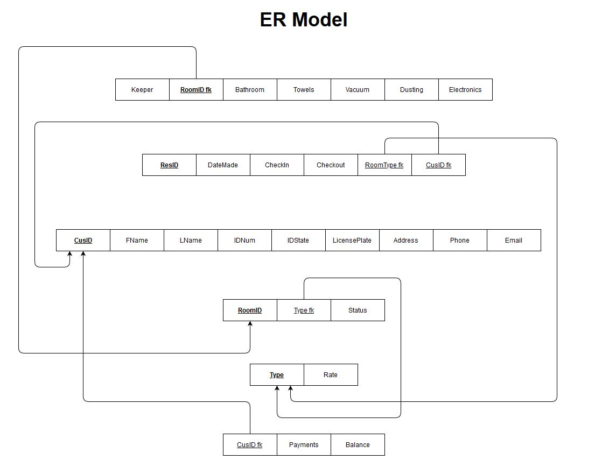

# 463_project
A project for Rodgers 463 Software Testing class at CSUF using QT.  

## ER Model

https://viewer.diagrams.net/?highlight=0000ff&edit=_blank&layers=1&nav=1#G15Pqxo8ypeWOY4yfjMoBBQ4i1x547UwDE

## Setting kits and compilers

I have been using MinGW as the compiler; seems to work fine.

# SQL Logic for Capabillities
The below capabillities will be spilt evenly amongst team members.  Pick two capabillities you would like to implement by editing this document and inserting your name after the capability number (e.g. Capabillity n -- John Smith).  Most, but not all, will involve SQL logic.  Develop your logic and insert it below your capabillities description.

### Capabillity 1
This screen will show all the rooms of the hotel.  The rooms will have the room number, room type, and status.  
#### The following are possible status for the rooms.
* Available
* Unavailable/Occupied
* Unavailable/Dirty
* Unavailable/Maintenance

#### The following are the type of rooms available:
* King (K)
* Double Queen (DQ)
* Double Queen with Kitchen (DQK)
* Suite (S)

### Capabillity 2
This screen will have a list of the room going down vertically and the next 7 days going across horizontally.  If the room is reserved for that day, it will have the guests name.  If it is not reserved, it will be blank.

### Capabillity 3
This list display will show each current reservation with the following information:  Guest First Name, Guest Last Name, Date Made,  Date Checkin,  Date Checkout,  Room Type,  Rate ($/Day), Total Charge

### Capabillity 4
This screen shows a list of all the dirty rooms.  It has the following information for each room: Housekeeper Name, Room number, Room Type, Room Status, Bathroom,  Towels, Bed Sheets, Vacuum, Dusting, Electronics.  

### Capabillity 5
This screen will show the guest profile information.  It will include the following information: First Name, Last Name, Phone, Address, E-mail,  ID Info (State, ID#), Vehicle License Plate.
If using a GUI, a photo of the guest or photo of ID.

### Capabillity 6
This screen will show the room/guest current stay information.  It will contain the following information:  Guest Name, Check In Date and Time, Expected Check Out Date and Time,  Room Type, Room Number, Room Rate ($/Day), Total Charge, Payments Made, Balance.

### Capabillity 7
This screen will allow the user to search for a guest using any of the following fields: Guest First Name, Guest Last Name, Room Number, Phone Number, Street Address, Check In Date, Checkout Date.

### Capabillity 8
This screen will show a report of the day’s activity.  It will show a list of rooms that were rented that day and also have the following information for each room: Room Number, Guest Name, Date In, Date Out (If Checked Out), Amount Paid for the room. At the bottom will be a total of dollars paid for rooms that day.
